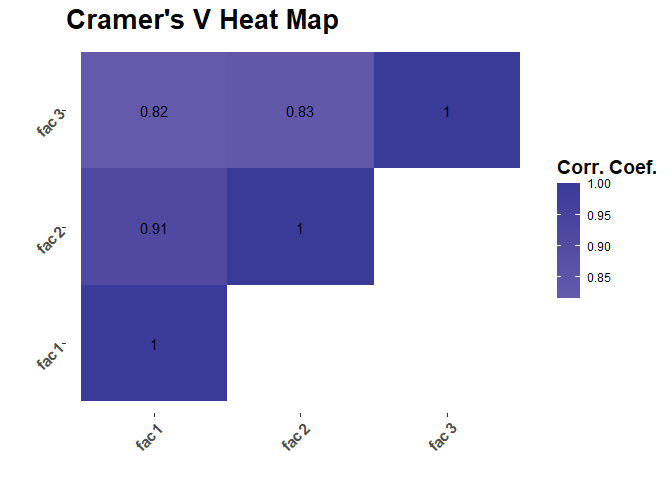

<!-- README.md is generated from README.Rmd. Please edit that file -->

# Numpute

<!-- badges: start -->
<!-- badges: end -->

The goal of CatCorr is to evaluate factor variables for correlation, a
task which is somewhat challenging given that traditional correlation
calculations are intended primarily for numeric variables.

## Installation

You can install the development version of CatCorr from
[GitHub](https://github.com/) with:

``` r
# install.packages("devtools")
devtools::install_github("easoneli176/CatCorr")
```

## Example

First, the crmv function takes 2 factor variables in the form of vectors
and calculates their Cramer’s V, which is the metric we use to
approximate correlation for factor variables throughout this package.

``` r
library(CatCorr)

mock_data<-data.frame(fac1 = c(rep("A",3),rep("B",3),rep("C",3),rep("D",3)) , fac2 = c(rep("E",3),rep("F",2),rep("G",4),rep("H",3)))

crmv(mock_data[,1],mock_data[,2])
#> Cramer V 
#>   0.9129
```

Taking this a step further, the onevarcv function takes one variable in
a dataframe and calculates its Cramer’s V with all other variables in
that dataframe.

``` r
mock_data$fac3<-c(rep("I",4),rep("J",4),rep("K",4))

onevarcv(mock_data[,1],mock_data)
#> [1] 1.0000 0.9129 0.8165
```

Continuing onward, the crmvtbl function calculates the Cramer’s V for
all variables in a dataframe.

``` r
crmvtbl(mock_data)
#>     fac1   fac2   fac3
#> 1 1.0000 0.9129 0.8165
#> 2 0.9129 1.0000 0.8292
#> 3 0.8165 0.8292 1.0000
```

Next, crmvtbl_condense is a helper function that takes a dataframe and
makes a new table compatible to be fed to catcorrplot

``` r
crmvtbl_condense(mock_data)
#>   Var1 Var2 Cramers_V
#> 1 fac1 fac1    1.0000
#> 2 fac1 fac2    0.9129
#> 3 fac2 fac2    1.0000
#> 4 fac1 fac3    0.8165
#> 5 fac2 fac3    0.8292
#> 6 fac3 fac3    1.0000
```

Finally, the catcorrplot function brings all these together and makes a
nice visualization for all the correlations between the factor values in
the dataframe.

``` r
catcorrplot(mock_data)
#> Warning in geom_text(aes(fill = test1$Cramers_V, label = round(test1$Cramers_V,
#> : Ignoring unknown aesthetics: fill
#> Warning: Use of `test1$Cramers_V` is discouraged.
#> ℹ Use `Cramers_V` instead.
#> Use of `test1$Cramers_V` is discouraged.
#> ℹ Use `Cramers_V` instead.
```


